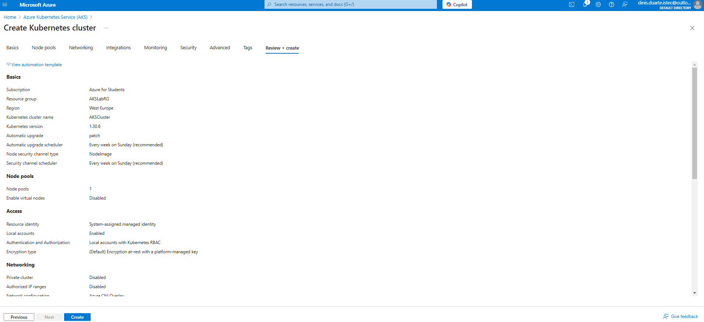
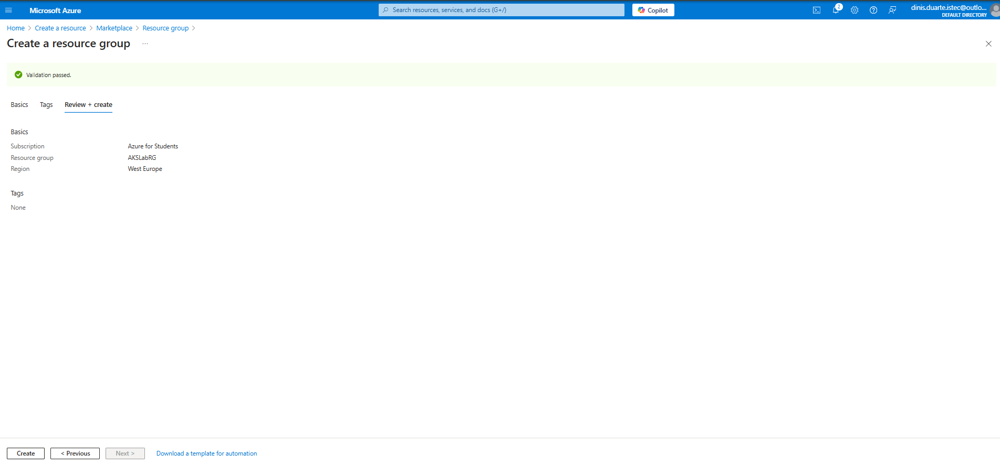
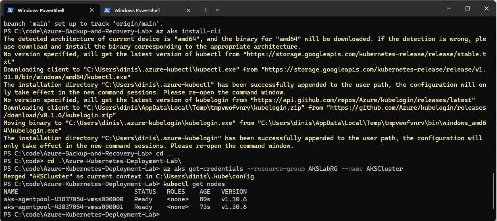
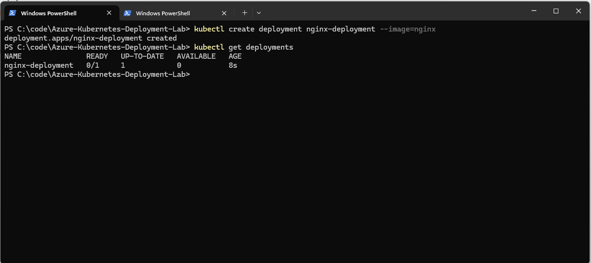
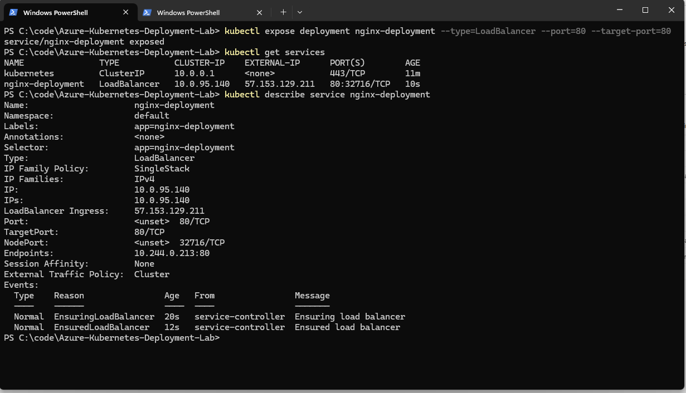
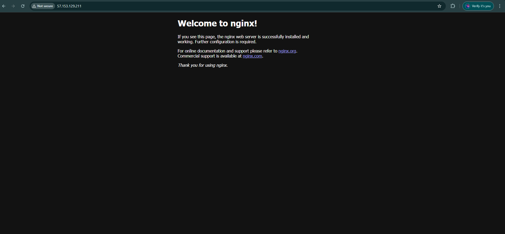

# Azure Kubernetes Deployment Lab
---
**A Hands-on Lab for Deploying and Managing Kubernetes Applications in Azure**
---

This project demonstrates how to deploy a Kubernetes cluster using Azure Kubernetes Service (AKS) and host an NGINX application. It covers the steps for creating the cluster, deploying the application, and exposing it through a LoadBalancer to make it accessible over the internet.

---

## Table of Contents
1. [Project Objectives](#project-objectives)
2. [Steps Implemented](#steps-implemented)
3. [Screenshots](#screenshots)
4. [Tools Used](#tools-used)
5. [Troubleshooting](#troubleshooting)
6. [Useful Links](#useful-links)
7. [License](#license)
8. [Contributions](#contributions)


---

## Project Objectives

- **Create a Kubernetes Cluster**  
  Set up an AKS cluster to manage containerized applications.

- **Deploy an Application**  
  Deploy an NGINX application using Kubernetes deployment.

- **Expose the Application**  
  Configure a LoadBalancer to expose the NGINX application on the internet.

- **Test Accessibility**  
  Verify that the application is accessible via its external IP address.

---

## Steps Implemented

1. **Create a Resource Group**  
   - Name: `AKSLabRG`  
   - Region: West Europe

2. **Create a Kubernetes Cluster**  
   - Cluster Name: `AKSCluster`  
   - Node Count: 1  
   - OS: Ubuntu  
   - Kubernetes Version: 1.30.6  

3. **Install Azure CLI Tools**  
   - Install `kubectl`:  
     ```bash
     az aks install-cli
     ```
   - Install `kubelogin`:  
     ```bash
     az aks install-azure-cli-login
     ```

4. **Connect to the Kubernetes Cluster**  
   - Configure access to the cluster:  
     ```bash
     az aks get-credentials --resource-group AKSLabRG --name AKSCluster
     ```
   - Verify nodes:  
     ```bash
     kubectl get nodes
     ```

5. **Deploy the NGINX Application**  
   - Create a deployment for the NGINX application:  
     ```bash
     kubectl create deployment nginx-deployment --image=nginx
     ```
   - Verify the deployment:  
     ```bash
     kubectl get deployments
     ```

6. **Expose the Application**  
   - Expose the application using a LoadBalancer service:  
     ```bash
     kubectl expose deployment nginx-deployment --type=LoadBalancer --port=80 --target-port=80
     ```
   - Retrieve the external IP of the service:  
     ```bash
     kubectl get services
     ```

7. **Test the Application**  
   - Open the application in a browser using the external IP retrieved in the previous step.
     Example URL: `http://<EXTERNAL-IP>`


---

## Screenshots

Below are the screenshots that illustrate the steps:

1. **AKS Cluster Creation**  
     
   *Configuration of the Kubernetes cluster in Azure, including region and node count settings.*

2. **Resource Group Creation**  
     
   *Resource group setup for organizing and managing Azure resources.*

3. **Cluster Connection Output**  
     
   *Successful connection to the Kubernetes cluster, showing available nodes and their status.*

4. **Deployment Overview**  
     
   *Status of the NGINX deployment, including readiness and availability of pods.*

5. **Service LoadBalancer**  
     
   *LoadBalancer service details, showing the external IP and port for accessing the application.*

6. **Application in Browser**  
     
   *NGINX welcome page displayed in the browser, verifying successful application deployment.*


---

## Tools Used

- **Azure Portal**  
  Used to create and manage the AKS cluster and associated resources through a graphical interface.

- **Azure CLI**  
  A command-line interface used to deploy and manage Kubernetes clusters in Azure, including configuration of `kubectl` and authentication.

- **kubectl**  
  The command-line tool used to interact with Kubernetes clusters for deploying, managing, and inspecting resources.

- **Web Browser**  
  Used to verify the accessibility of the deployed NGINX application via its external IP address.


---
## Troubleshooting

### Common Issues and Resolutions

1. **Quota Limit for Public IPs**
   - **Issue:** Error message stating: `Cannot create more than X public IP addresses for this subscription in this region.`
   - **Resolution:**
     - Check the current quota for public IPs in your Azure subscription:
       ```bash
       az network public-ip list-usage --location <region>
       ```
     - Request a quota increase via the Azure Portal:
       1. Navigate to **Azure Portal > Subscriptions > Usage + Quotas**.
       2. Select **Request Increase** for the Public IP Addresses quota.
     - Alternatively, delete unused public IPs:
       ```bash
       az network public-ip delete --name <public-ip-name> --resource-group <resource-group-name>
       ```

2. **Kubernetes Deployment Stuck in Pending**
   - **Issue:** Deployment or pods are stuck in the `Pending` state.
   - **Resolution:**
     - Check the pod events for errors:
       ```bash
       kubectl describe pods
       ```
     - Verify node resources are sufficient:
       ```bash
       kubectl describe nodes
       ```
     - Scale up the cluster if needed:
       ```bash
       az aks scale --resource-group AKSLabRG --name AKSCluster --node-count <new-node-count>
       ```

3. **Service External IP Not Assigned**
   - **Issue:** The external IP for the LoadBalancer service shows as `<pending>` for an extended time.
   - **Resolution:**
     - Verify the service events:
       ```bash
       kubectl describe service nginx-deployment
       ```
     - Ensure the LoadBalancer is correctly configured:
       ```bash
       kubectl get services
       ```
     - Check Azure resources in the portal to confirm the LoadBalancer is being provisioned.

4. **kubectl Authentication Fails**
   - **Issue:** Error message stating: `Unable to authenticate to the Kubernetes cluster.`
   - **Resolution:**
     - Ensure `kubelogin` is installed and configured:
       ```bash
       az aks install-azure-cli-login
       ```
     - Reauthenticate to the cluster:
       ```bash
       az aks get-credentials --resource-group AKSLabRG --name AKSCluster --overwrite-existing
       ```

5. **Application Not Accessible via External IP**
   - **Issue:** Accessing the application using the external IP returns an error or timeout.
   - **Resolution:**
     - Verify the service configuration:
       ```bash
       kubectl get services
       ```
     - Confirm the firewall rules and network security groups in Azure allow traffic on port 80.
     - Restart the LoadBalancer service:
       ```bash
       kubectl delete service nginx-deployment
       kubectl expose deployment nginx-deployment --type=LoadBalancer --port=80 --target-port=80
       ```

---

## Useful Links

- [Azure Kubernetes Service Documentation](https://learn.microsoft.com/en-us/azure/aks/)  
  Comprehensive guide for deploying and managing Kubernetes clusters in Azure.

- [kubectl Reference Documentation](https://kubernetes.io/docs/reference/kubectl/)  
  Official documentation for using `kubectl`.

- [NGINX Documentation](https://nginx.org/en/docs/)  
  Detailed information about NGINX configuration and usage.

---

## License

This project is licensed under the [MIT License](./LICENSE).  
See the LICENSE file for detailed terms and conditions.

---

## Contributions

Contributions are welcome!  
If you have suggestions for improvements or additional use cases, feel free to [fork this repository](https://github.com/dinAlexDu/Azure-Kubernetes-Deployment-Lab) and submit a pull request.  

Please adhere to our [Code of Conduct](./CODE_OF_CONDUCT.md) when contributing to this project.
